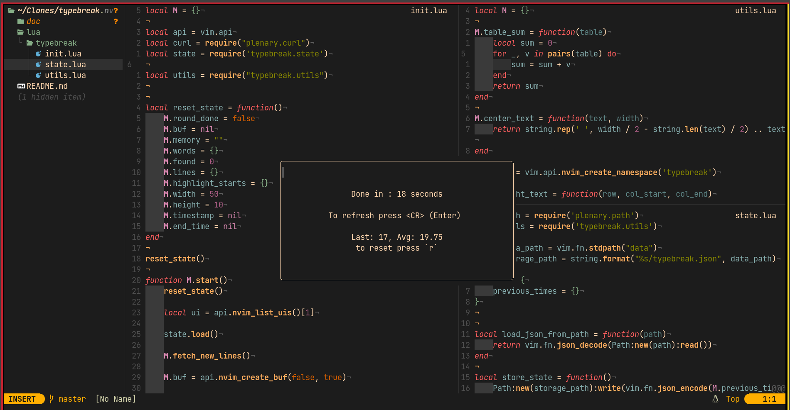

# typebreak.nvim


<details>
<summary>Screencast asciinema</summary>


</details>

<details>
<summary>Summary stats</summary>

</details>

Take a brief break from current work and use it to speed up your typing speed.

# Install

use your favorite plugin manager to install with [plenary](https://github.com/nvim-lua/plenary.nvim) as dependency:

Plug
```viml
Plug 'nagy135/typebreak.nvim'
Plug 'nvim-lua/plenary.nvim'
```

Packer
```lua
use { 'nagy135/typebreak.nvim', requires = 'nvim-lua/plenary.nvim' }

-- with binding

use { 'nagy135/typebreak.nvim',
    requires = 'nvim-lua/plenary.nvim',
    config = function()
        vim.keymap.set('n', '<leader>tb', require('typebreak').start, { desc = "Typebreak" })
    end
}
```

# Usage

Bind it first! (using setup section bellow), doesnt bind to anything by default.

Pressing bind opens new floating window with words and puts you in insert mode.
You can instantly start typing and words are getting highlighted as you type them, then dissapear.
Once you type them all, you see summary prompt with stats and option to play again.
Close the window whenever you want <kbd>ctrl</kbd> + <kbd>w</kbd>, <kbd>q</kbd>

# Setup
Bind start function to some key

``` viml
nnoremap <leader>tb :lua require("typebreak").start()<CR>
```
```lua
vim.keymap.set('n', '<leader>tb', require('typebreak').start, { desc = "Typebreak" })

```

# Custom dictionary
There is also option to NOT use [herokuapp](https://random-word-api.herokuapp.com/word?number=10) for fetching words.
By default we use it but if you wanna use local dictionary instead, you need to do following:

First you simply pass true to start function
```lua
require("typebreak").start(true)
```

Or better, bind it
```viml
nnoremap <leader><leader>tb :lua require("typebreak").start(true)<CR>
```

This uses 200 words long dictionary shipped with plugin.

If you want to extend or replace those words you need to call `setup()` any time before calling `start()`
```lua
require('typebreak').setup({
    ["dictionary"] = {"tik", "tak", "toe"},
    -- also boolean flag if you want to replace default ones with your own only
    -- ["replace_dictionary"] = true
})
```
